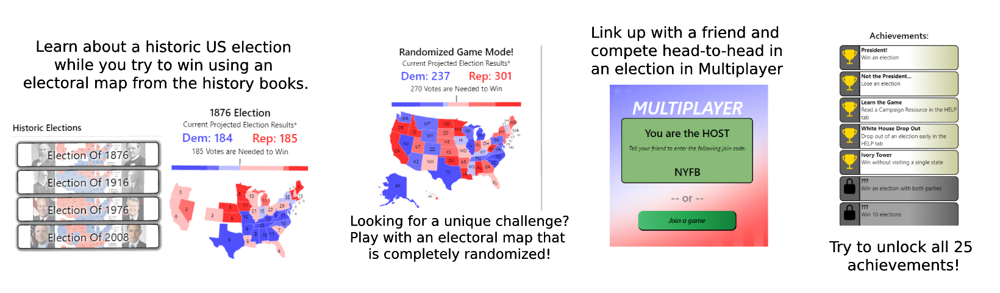

# Campaign Game

In this 'Presidential Election Simulation Game', play as a presidential hopeful on the campaign trail. Look at real time polling data/map of projected voter outcome, and focus your time and resources on swaying voters in key states.   

This is an ionic/angular app, made using the ionic tabs default.  

A live demo is available at [Live Demo](https://jeremymlewis.github.io)
Please note that the live demo is best viewed on a mobile device, or simulating one through dev tools.

Code for the app pages is found in the src/app folder and is organized primarily by which page it belongs to. 
Main gameplay is sorted by which tab it belongs to, and other page types (intro, achievements, results page) are in their own folders.
The votes store (a ts file) is where data about game state/score is held and populated. 

The data-store folder contains the votesStore -- where the game state is stored so it can be shared across many pages.

The services folder contains:
* Text service that is responsible for most of the text-based content of the app
* Multiplayer service that deals with connecting the game to a simple socket (via a simple node.js express server) that allows for real-time multiplayer
* Appstore service that will facilitate in-app purchases (future development)
* Audio service that is completely commented-out for now since the sounds were too annoying/distracting
* API folder that contains some old code for logging in to save progress (removed in favor of someday adding 'Apple Game Center' authentication instead.)
